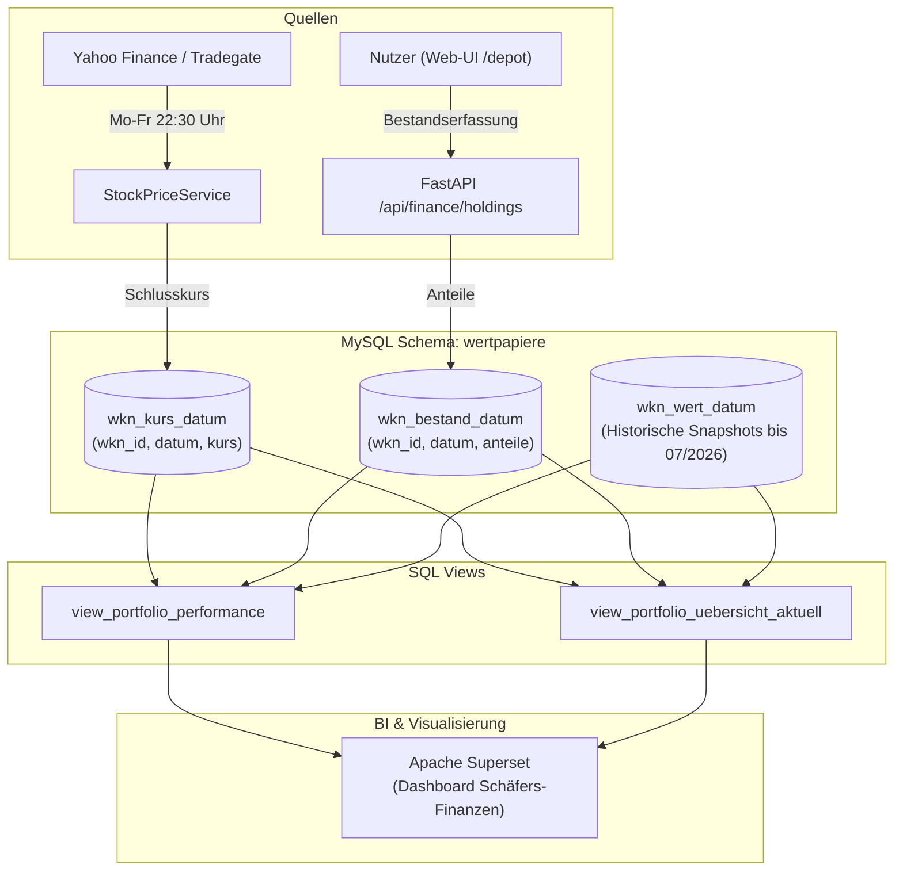

# Design-Spezifikation: Trennung von Kurswert, Anteilsbestand und Gesamtwert im Wertpapiere-Modul

**Datum:** 2026-09-28  
**Status:** Genehmigt (Architektur-Design)  
**Autor:** Antigravity & User  
**Projekt:** `data-recording`  

---

## 1. Ausgangslage & Problemstellung

In der MySQL-Datenbank `wertpapiere` enthielt die historische Tabelle `wkn_wert_datum` Stichtagseinträge (von 2020 bis 2026-07-16), bei denen die Spalte `wert` den **Gesamtwert der Anteile** (z. B. `20547.90 €`) darstellte.

Durch die Implementierung des täglichen Kursabfrage-Dienstes (`stock_price_service.py`) wurden am 2026-09-25 die von Yahoo Finance / Tradegate ermittelten **Stückkurse** (z. B. `128.88 €` für WKN A1T8FV) fälschlicherweise direkt in `wkn_wert_datum.wert` gespeichert. Dadurch brach der berechnete Gesamtwert im Dashboard ein und verursachte fiktive Verluste von über `-99%`.

Zudem fehlte im System eine Datenstruktur zur Erfassung und Verwaltung der tatsächlich gehaltenen **Anteile (Stückzahl)** je Wertpapier. Da Anteile durch variable Kaufkurse und Transaktionsgebühren nicht rein rechnerisch aus Sparplan-Einzahlungen exakt abgeleitet werden können, muss der Nutzer seinen Stichtagsbestand an Anteilen beisteuern können.

---

## 2. Zielarchitektur & Lösungsansatz

Wir implementieren **Ansatz 1: Duale Tabellen (`wkn_kurs_datum` + `wkn_bestand_datum`) mit dynamischer View-Aggregation**.



---

## 3. Datenbankschema & Migration

### 3.1 Tabelle `wertpapiere.wkn_kurs_datum`
Speichert tägliche Schlusskurse je Wertpapier:
```sql
CREATE TABLE IF NOT EXISTS wertpapiere.wkn_kurs_datum (
    id INT AUTO_INCREMENT PRIMARY KEY,
    wkn_id INT NOT NULL,
    datum DATE NOT NULL,
    kurs DECIMAL(10, 4) NOT NULL,
    erfasst_am DATETIME DEFAULT CURRENT_TIMESTAMP,
    CONSTRAINT fk_wkn_kurs_etf FOREIGN KEY (wkn_id) REFERENCES wertpapiere.etf(id) ON DELETE CASCADE,
    UNIQUE KEY uq_wkn_kurs_wkn_datum (wkn_id, datum),
    INDEX idx_wkn_kurs_datum (datum)
) ENGINE=InnoDB DEFAULT CHARSET=utf8mb4;
```

### 3.2 Tabelle `wertpapiere.wkn_bestand_datum`
Speichert Stichtags-Anteilsbestände je Wertpapier:
```sql
CREATE TABLE IF NOT EXISTS wertpapiere.wkn_bestand_datum (
    id INT AUTO_INCREMENT PRIMARY KEY,
    wkn_id INT NOT NULL,
    datum DATE NOT NULL,
    anteile DECIMAL(12, 4) NOT NULL,
    erfasst_am DATETIME DEFAULT CURRENT_TIMESTAMP,
    CONSTRAINT fk_wkn_bestand_etf FOREIGN KEY (wkn_id) REFERENCES wertpapiere.etf(id) ON DELETE CASCADE,
    UNIQUE KEY uq_wkn_bestand_wkn_datum (wkn_id, datum),
    INDEX idx_wkn_bestand_datum (datum)
) ENGINE=InnoDB DEFAULT CHARSET=utf8mb4;
```

### 3.3 Datenbereinigung & Migration in `wkn_wert_datum`
1. Übertragen der 4 Kurswerte vom `2026-09-25` (`wkn_id IN (1, 3, 4, 9)`) in `wkn_kurs_datum`.
2. Löschen dieser 4 Zeilen aus `wkn_wert_datum`.
3. Alle historischen Einträge in `wkn_wert_datum` (bis zum Stichtag `2026-07-16`) bleiben als Gesamtwert-Referenz erhalten.

---

## 4. Backend-Services & Models

### 4.1 SQLAlchemy Models (`src/data_recorder/models/wertpapiere.py`)
* Definition von `WknKursDatum` mit Mapping auf `wertpapiere.wkn_kurs_datum`.
* Definition von `WknBestandDatum` mit Mapping auf `wertpapiere.wkn_bestand_datum`.
* Ergänzung der Relationships in `Etf`:
  * `kurs_daten: Mapped[list["WknKursDatum"]]`
  * `bestand_daten: Mapped[list["WknBestandDatum"]]`

### 4.2 Kursabfrage-Dienst (`src/data_recorder/services/stock_price_service.py`)
* `save_stock_price(...)` speichert Schlusskurse ausschließlich in `wkn_kurs_datum`.
* Idempotentes Update bei doppeltem Aufruf desselben Tages.

### 4.3 REST-API Endpunkte (`src/data_recorder/api/routes_finance.py`)
* `POST /api/finance/update-prices`: Manuelle Kursabfrage, schreibt nach `wkn_kurs_datum`.
* `GET /api/finance/latest-prices`: Liefert die jeweils aktuellsten Notierungen aus `wkn_kurs_datum`.
* `GET /api/finance/holdings`: Übersicht aller aktiven Wertpapiere mit neuestem Bestand, Stichtag, Kurs und aktuellem Gesamtwert.
* `GET /api/finance/holdings/history`: Historische Liste aller erfassten Bestände.
* `POST /api/finance/holdings`: Speichert oder aktualisiert Stichtagsanteile (`wkn_id`, `datum`, `anteile`).
* `DELETE /api/finance/holdings/{id}`: Löscht einen Bestands-Eintrag.

---

## 5. Web-UI (`/depot`)

### 5.1 Navigation & Einbindung
* `src/data_recorder/templates/base.html`: Erweiterung des Headers um den Menüpunkt **`Depot`** (`/depot`).
* Route `GET /depot` in `routes_finance.py` (oder dedizierter Route-Datei) liefert `depot.html`.

### 5.2 Benutzeroberfläche (`src/data_recorder/templates/depot.html`)
* **KPI-Header**:
  * Gesamtdepotwert (Summe aller aktuellen Positionen).
  * Letzter Kursabfragestand mit Aktualisierungs-Button ("Kurse jetzt abrufen").
* **Übersichtskarten / -tabelle**:
  * Jedes aktive Wertpapier mit Name, WKN, Ticker, aktuellem Kurs, aktuellem Anteil und aktuellem Wert.
  * Button "Bestand erfassen" öffnet Schnelleingabedialog mit vorausgewähltem Wertpapier.
* **Erfassungs-Modal/Formular**:
  * Wertpapier, Datum (Default: heute), Anteile (Decimal mit bis zu 4 Nachkommastellen).
* **Historie**:
  * Tabelle der erfassten Stichtagsbestände mit Lösch-Möglichkeit.

---

## 6. SQL-Views & Superset-Integration

### 6.1 `wertpapiere.view_portfolio_performance`
* Hybride Zeitreihe aus:
  1. Historischen Datensätzen aus `wkn_wert_datum` (`datum <= '2026-07-16'`).
  2. Täglichen Datensätzen aus `wkn_kurs_datum` mit dynamischer Berechnung:
     $$\text{depotwert} = \text{anteile} \times \text{kurs}$$
     wobei `anteile` der jüngste bekannte Bestand $\le \text{datum}$ ist.
* Berechnung von `kumuliertes_invest`, `kumulierter_ertrag`, `gesamtwert_inkl_ertrag`, `gewinn_verlust_euro` und `rendite_prozent`.

### 6.2 `wertpapiere.view_portfolio_uebersicht_aktuell`
* Ermittelt für alle aktiven Wertpapiere:
  * Aktuellen Tageskurs
  * Aktuellen Anteilsbestand
  * Aktuellen Gesamtwert
  * Summe Investitionen & Erträge
  * Absolute und prozentuale Gesamtrendite.

### 6.3 Superset Dashboard (`Schäfers-Finanzen`, ID 2)
* Synchronisation der Superset Datasets 63 und 64 mit den neuen View-Spalten (`kurs`, `anteile`).
* Bereinigung des Redis-Caches.

---

## 7. Verifikations- & Teststrategie

1. **Unit- & Integrationstests (pytest)**:
   * Testen der neuen Models `WknKursDatum` und `WknBestandDatum`.
   * Testen von `StockPriceService` mit Mocking von Yahoo Finance.
   * Testen der API-Endpunkte unter `/api/finance/holdings`.
2. **Datenbankmigration & Bereinigung**:
   * Migration auf NAS MySQL ausführen und verifizieren.
   * Bereinigung der fehlerhaften Datensätze prüfen.
3. **End-to-End Test im Browser & Superset**:
   * Aufruf von `http://192.168.2.125:8000/depot` (Testen der Anteils-Eingabe).
   * Verifikation des Superset Dashboards `http://192.168.2.125:8088/superset/dashboard/2/`.
